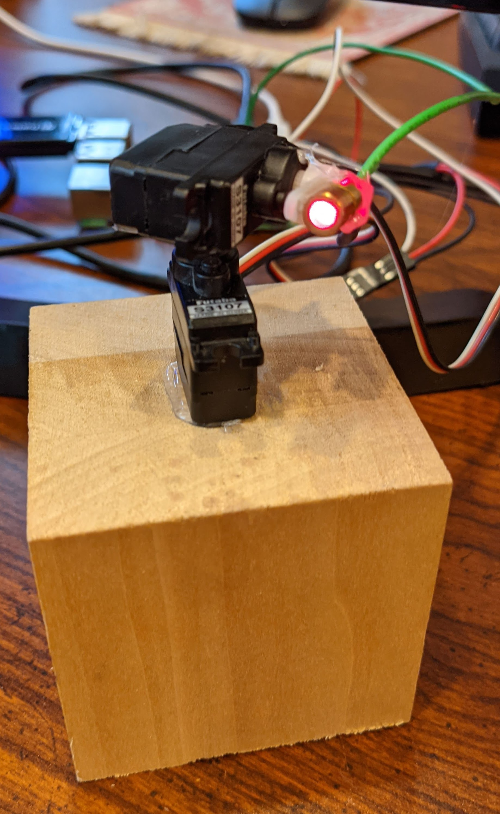
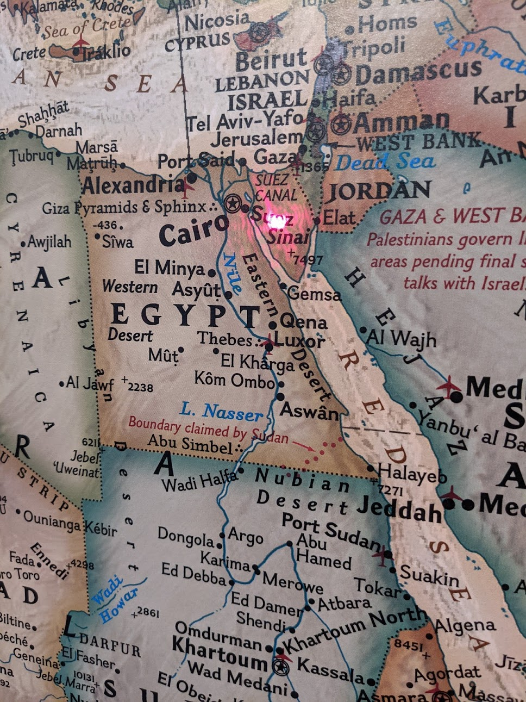

# laser-pointer
laser mounted on simple servo turret to point to interesting locations on a map

I have a large map (9ft x 6ft) in my home office. It's a triumph of cartography really. [You can get it here for $100](https://www.natgeomaps.com/re-world-executive-mural). Installation is the same as wall paper.

I had some servos (from R/C airplane hobby) and an extra raspberry pi and was inspired by an online tutorial (can't find link) in which the creator used hot glue to stick the servos and laser together... so now I have a thing which points a laser at my map.

Future goal is to have it read news stories from an API, figure out their location and point the laser at them. Like this weeks story about the ship stuck in the Suez canal.

## Parts
* Raspberry pi 4 (SD card required 16gb works for me, micro HDMI cable recommended)
* 2 Servo's (futaba S3107 for now... might update for more accuracy)
* Laser (I got [these laser diodes](https://www.amazon.com/gp/product/B00VCR036Q/ref=ppx_yo_dt_b_search_asin_title?ie=UTF8&psc=1) a few years ago to upgrade a nerf gun)
* Hot glue
* A base (block of wood for me)
* Wiring (I have tons of wiring stuff from other projects)
* A map ([NatGeo 9'x6' : $100](https://www.natgeomaps.com/re-world-executive-mural).)

I tried to get this working with an ESP8266, but getting 5V to the servos was proving to be a PITA and the project was sitting next to a raspberry pi so I switched.

Warning: requirements.txt and some raspberry pi gpio pin libraries not 100% automated