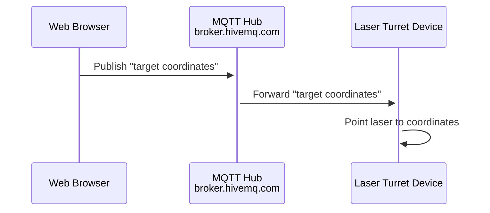
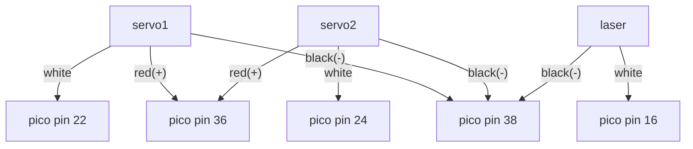

# laser-pointer
Laser mounted on servo turret to point to interesting locations on a map

## Description
I have a large map (9ft x 6ft) in my home office. It's a triumph of cartography really. [You can get it here for $100](https://www.natgeomaps.com/re-world-executive-mural). Installation is the same as wall paper.

I had some servos (from R/C airplane hobby) and an extra raspberry pi and was inspired by an online tutorial (can't find link) in which the creator used hot glue to stick the servos and laser together... so now I have a thing which points a laser at my map.

Future goal is to have it read news stories from an API, figure out their location and point the laser at them. Like this weeks story about the ship stuck in the Suez canal.

## Communications


## Wiring


## Parts
## Parts

| Part | Price | Link |
|------|-------|------|
| Raspberry PI pico W| $10    | [Amazon 2 pack](https://www.amazon.com/Generic-Raspberry-Pi-Pico-W/dp/B0B72GV3K3/ref=sr_1_3?crid=2K137W6XNPJK8&dib=eyJ2IjoiMSJ9.fwbQmoH_WONpf6FqMJoavfzdn5vy736RFtCMg11NzyEFKoys4DFXNL12Vsqj7Gp3ixEk9JAX4YZXMHE4RLIdrXwT1tMxz8JbXbxj3bOf57HZ5FphAV6vwMJSAb1ptbMsZw178-5ASCQ6Q9Eo7SpMk_V3fBekw_kDSaiRqOtebAaS5B9NPjqNaL9DAmSZ3PtfX9__uGUgLWpfygibvi_4mR4juXOLWlxsFnsO7EMebMRUpNB_ixosMQhlAF4842RdrYXckvXm5u-dRwA2hFtX7gPNr2iNb-k_8kTiPdYryVg.M0ygpsSHr3w7Yh-QGroRvF5fG_0nS0QQTdisLFbwtEU&dib_tag=se&keywords=raspberry+pico+wireless&qid=1719678570&s=electronics&sprefix=raspberry+pico+wireless%2Celectronics%2C75&sr=1-3) |
| 2 Servo's (futaba S3107 for now... might update for more accuracy) | $1.87 | [Amazon 10 pack](https://www.amazon.com/Smraza-Helicopter-Airplane-Control-Arduino/dp/B07L2SF3R4/ref=sr_1_5?dib=eyJ2IjoiMSJ9.B1FV6XhY9VGPX3YTctXkv0uxBJu5imsIOHIQEgQ4BK1sGoLGgecZwodssth1L0IGK25th1JhKZbr9Judayh4SWJWu7haSgF0HjHezBd2SgEowK-vshf3HOCQXBMusSfAXnd_7QjApBNcMh6noenJF4xve8dVX46ZkE-BXQC2L845WpDv0veP0tUWI42oODGojeQFDXFBUpEimg_93CQfKqSgTZoC7Jeze8kRMPadKFDoYmGoWLcgDn6wLJQBMBJAqOR8lMZcmG1eDOMqyKVwCGMsa5Qiaz4nRj3ZDJxJ42s.IeItW1l-SOlQ08tqVhkFQgDtjdjxKhxd6_y5vkt7uMM&dib_tag=se&keywords=S3107%2Bservo&qid=1719678639&sr=8-5&th=1) |
| Laser | $1.05 | [Amazon 5 pack](https://www.amazon.com/gp/product/B00VCR036Q/ref=ppx_yo_dt_b_search_asin_title?ie=UTF8&psc=1) 
| Hot glue | |
| A base (block of wood for me)
| Wiring (I have tons of wiring stuff from other projects)
| A map | $100 | [National Geographic NatGeo 9'x6'](https://www.natgeomaps.com/re-world-executive-mural)

I tried to get this working with an ESP8266, but getting 5V to the servos was proving to be a PITA and the project was sitting next to a raspberry pi so I switched. Then another project had me buying pi pico's so I switched again.

## Callibration
Point to a well known point and allow user to adjust with keyboard

Detecting keyboard input is IMPOSSIBLE I think.
pygame + pynput require a display to be connected

Honalulu
Brisbane

## Projection / Linear Extrapolation
Not 100% perfect, but here's the plan
1. Manually locate a bunch of points using calibration setup
1. To project a new point, find the 2 closest and extrapolate along a line between them

## Raspberry PI pico setup
installint umqtt library
```
import mip
mip.install("umqtt.simple")
```

## Proposed Enhancements
* Mount camera as well
* Facial Recognition
* Target people by name (spin the bottle type action)
* Recognize things in the room
* Target things

# 2024-06-16
x and y range is 0 to 1000

servo x
left = 970000
right = 470000

servo y
top = 1370000
bottom = 1670000


